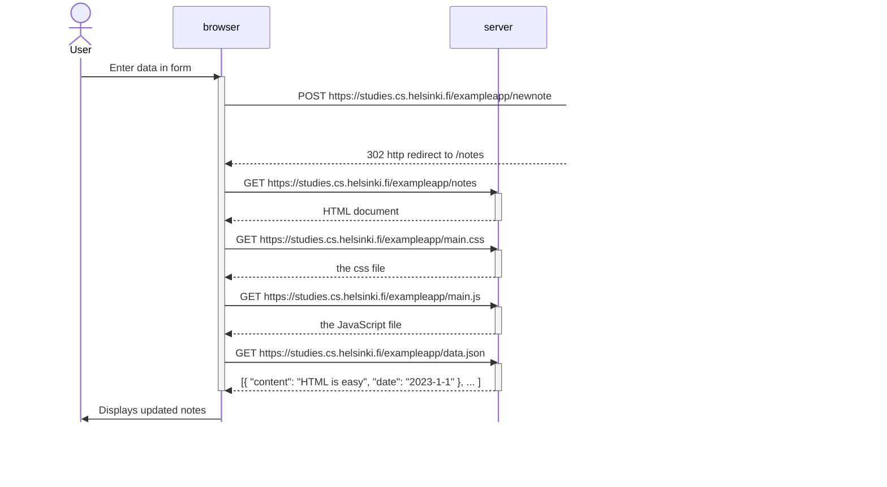

```mermaid
sequenceDiagram
    actor u as User 
    participant b as browser
    participant server
    participant nn as /newnote

    u->>b : Enter data in form
    activate b

    b->>nn: POST https://studies.cs.helsinki.fi/exampleapp/newnote
    activate nn
    Note right of nn: data.json is updated with new entry from user
    nn-->>b: 302 http redirect to /notes
    deactivate nn

    b->>server: GET https://studies.cs.helsinki.fi/exampleapp/notes
    activate server
    server-->>b: HTML document
    deactivate server

    b->>server: GET https://studies.cs.helsinki.fi/exampleapp/main.css
    activate server
    server-->>b: the css file
    deactivate server

    b->>server: GET https://studies.cs.helsinki.fi/exampleapp/main.js
    activate server
    server-->>b: the JavaScript file
    deactivate server
    
    b->>server: GET https://studies.cs.helsinki.fi/exampleapp/data.json
    activate server
    server-->>b: [{ "content": "HTML is easy", "date": "2023-1-1" }, ... ]
    deactivate server

    deactivate b
    b->>u : Displays updated notes

```